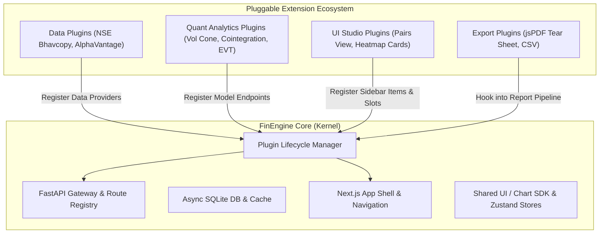

# 01. Plugin Architecture Blueprint

## 1. High-Level Vision
FinEngine (Daisy Risk Engine) operates on an **Open Core + Pluggable Extension** model:
- **Core Engine (Kernel)**: Manages SQLite database, portfolio positions CRUD, Next.js app shell, theme tokens, authentication, and the dynamic plugin loader.
- **Plugins**: Self-contained packages (first-party or community-created) containing quant models, market data ingestors, dashboard widgets, and custom report sections.



---

## 2. The 4 Core Plugin Extension Types

| Plugin Type | Responsibility | Backend Contract | Frontend Contract |
| :--- | :--- | :--- | :--- |
| **Data Provider** | Market data, order books, macro feeds | `BaseDataProvider` | Provider settings UI & status badges |
| **Quant Analytics** | Risk metrics, GARCH, EVT, optimization | `BaseQuantModel` | Interactive chart cards & parameter forms |
| **Studio / View** | Standalone analysis workspace | Dedicated router (`/api/v1/plugins/{id}/*`) | Full Next.js page registered in Sidebar |
| **Report / Export** | Institutional exports, PDF tear sheets | `BaseReportSection` hook | jsPDF page generators or export triggers |

---

## 3. Backend Plugin Interface (`app/sdk/plugin.py`)

```python
from abc import ABC, abstractmethod
from typing import Optional, Dict, Any, List
from fastapi import APIRouter
from pydantic import BaseModel

class PluginManifest(BaseModel):
    id: str                             # Unique slug, e.g. "quant-cointegration"
    name: str                           # Display name: "Cointegration Scanner"
    version: str                        # "1.0.0"
    category: str                       # "quant" | "data" | "indicator" | "research"
    description: str
    author: str = "Community"
    ui_routes: List[Dict[str, Any]] = [] # Navigation & slot hooks

class FinEnginePlugin(ABC):
    """Base class for all FinEngine plugins."""
    manifest: PluginManifest

    def get_router(self) -> Optional[APIRouter]:
        """FastAPI router mounted at /api/v1/plugins/{id}"""
        return None

    def on_startup(self) -> None:
        """Startup lifecycle hook (database table warmup, cache preload)."""
        pass

    def on_shutdown(self) -> None:
        """Graceful shutdown hook."""
        pass
```

---

## 4. Dynamic Backend Plugin Loader (`app/core/loader.py`)

```python
import importlib
import pkgutil
from pathlib import Path
from fastapi import FastAPI
from app.sdk.plugin import FinEnginePlugin

class PluginLoader:
    def __init__(self, app: FastAPI):
        self.app = app
        self.registered_plugins: dict[str, FinEnginePlugin] = {}

    def load_all(self, plugins_dir: str = "plugins"):
        path = Path(plugins_dir)
        if not path.exists():
            return

        for _, folder_name, _ in pkgutil.iter_modules([str(path)]):
            try:
                mod = importlib.import_module(f"plugins.{folder_name}.plugin")
                if hasattr(mod, "get_plugin"):
                    plugin: FinEnginePlugin = mod.get_plugin()
                    self._register(plugin)
            except Exception as e:
                print(f"[PluginLoader] Failed to load plugin {folder_name}: {e}")

    def _register(self, plugin: FinEnginePlugin):
        meta = plugin.manifest
        self.registered_plugins[meta.id] = plugin
        
        router = plugin.get_router()
        if router:
            self.app.include_router(
                router,
                prefix=f"/api/v1/plugins/{meta.id}",
                tags=[f"Plugin: {meta.name}"]
            )
        plugin.on_startup()
```

---

## 5. Frontend Dynamic Slot & Sidebar System

### Slot Component (`PluginSlot.tsx`):
```tsx
import React from "react";
import { pluginRegistry } from "@/lib/plugins/registry";

export function PluginSlot({ name }: { name: string }) {
  const widgets = pluginRegistry.getWidgetsForSlot(name);
  return (
    <div className="grid grid-cols-1 md:grid-cols-2 gap-4">
      {widgets.map((w, idx) => (
        <w.component key={idx} portfolioId="current" />
      ))}
    </div>
  );
}
```

### Auto-Populated Navigation (`Sidebar.tsx`):
1. Frontend queries `GET /api/v1/plugins`.
2. Returns active `ui_routes`.
3. Sidebar dynamically renders links without hardcoded route imports.