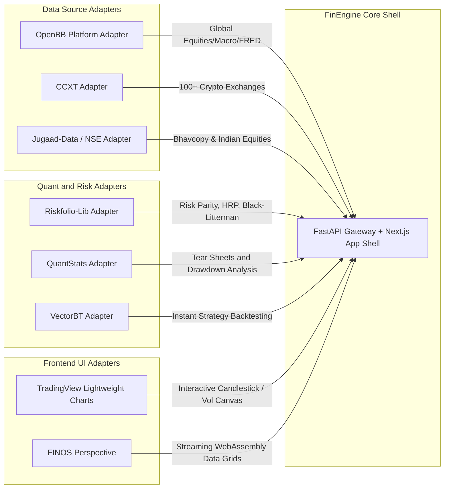

# 02. Open-Source Ecosystem & Adapter Pattern

## 1. The Strategy: Borrow, Don't Re-implement
Instead of re-inventing heavy financial mathematics from scratch, FinEngine acts as the **central orchestration, UI, and risk shell**, while thin **Adapter Plugins** bridge into mature open-source engines.



---

## 2. Master Comparison of Borrowable OSS Projects

| Project | Domain | Value Provided | Best Adapter Type | License |
| :--- | :--- | :--- | :--- | :--- |
| **[Riskfolio-Lib](https://github.com/dcajasn/Riskfolio-Lib)** | Quant Risk / Portfolio Opt | 30+ convex optimization models (HRP, Mean-CVaR, Black-Litterman). | `BaseQuantModel` | BSD-3-Clause (Permissive) |
| **[skfolio](https://github.com/skfolio/skfolio)** | Scikit-Learn Portfolio Risk | ML-compatible asset allocation and cross-validation. | `BaseQuantModel` | BSD-3-Clause (Permissive) |
| **[QuantStats](https://github.com/ranaroussi/quantstats)** | Performance Tear Sheets | 60+ metrics (Sharpe, Sortino, Calmar, underwater drawdowns). | `BaseReportSection` | Apache 2.0 (Permissive) |
| **[TradingView Lightweight Charts](https://github.com/tradingview/lightweight-charts)** | Frontend Financial Charts | High-performance HTML5 canvas candlesticks and volume bars. | React UI Component | Apache 2.0 (Permissive) |
| **[CCXT](https://github.com/ccxt/ccxt)** | Crypto Data & Trading | Unified REST/WebSocket API for 100+ crypto exchanges. | `BaseDataProvider` | MIT (Permissive) |
| **[jugaad-data](https://github.com/stream3/jugaad-data)** | Indian Market Ingestion | Automated NSE Bhavcopy and index historical data. | `BaseDataProvider` | MIT (Permissive) |
| **[OpenBB Platform](https://github.com/OpenBB-finance/OpenBB)** | Universal Market Data | Single API to 100+ providers (FRED, FMP, SEC EDGAR, Yahoo). | Isolated Sidecar | AGPL-3.0 (Copyleft) |
| **[VectorBT](https://github.com/polakowo/vectorbt)** | Ultra-Fast Backtesting | Numba-accelerated vectorized backtesting. | BYOL Plugin | Commons Clause (Restricted) |

---

## 3. Concrete Adapter Implementation Examples

### A. Riskfolio-Lib Optimization Adapter
```python
# plugins/quant_riskfolio_adapter/plugin.py
import riskfolio as rp
import pandas as pd
from app.sdk.plugin import FinEnginePlugin, PluginManifest

class RiskfolioAdapterPlugin(FinEnginePlugin):
    manifest = PluginManifest(
        id="quant-riskfolio-opt",
        name="Riskfolio-Lib Optimizer",
        version="1.0.0",
        category="quant",
        description="Convex optimization: HRP, Risk Parity, and Mean-CVaR"
    )

    async def optimize(self, returns_dict: dict[str, list[float]], model: str = "HRP"):
        df = pd.DataFrame(returns_dict)
        port = rp.Portfolio(returns=df)
        port.assets_stats(method_mu='hist', method_cov='hist')
        
        if model == "HRP":
            w = port.Optimization(model='HRP', codependence='pearson', rm='MV', rf=0.0)
        else:
            w = port.Optimization(model='Classic', rm='CVaR', obj='Sharpe', rf=0.0)
            
        weights = {ticker: float(val) for ticker, val in w.iloc[:, 0].items()}
        return {"weights": weights, "effective_n": float(1.0 / sum(v**2 for v in weights.values()))}
```

### B. QuantStats Tear Sheet Adapter
```python
# plugins/quant_quantstats_adapter/plugin.py
import quantstats as qs
import pandas as pd
from app.sdk.plugin import FinEnginePlugin, PluginManifest

class QuantStatsAdapterPlugin(FinEnginePlugin):
    manifest = PluginManifest(
        id="quant-quantstats",
        name="QuantStats Tear Sheet",
        version="1.0.0",
        category="quant",
        description="Institutional performance and drawdown statistics"
    )

    async def analyze(self, returns: list[float], benchmark: list[float] = None):
        s = pd.Series(returns)
        bench = pd.Series(benchmark) if benchmark else None
        return {
            "sharpe": float(qs.stats.sharpe(s)),
            "sortino": float(qs.stats.sortino(s)),
            "max_drawdown": float(qs.stats.max_drawdown(s)),
            "cvar_95": float(qs.stats.cvar(s, cutoff=0.05)),
            "monthly_returns": qs.stats.monthly_returns(s).to_dict()
        }
```