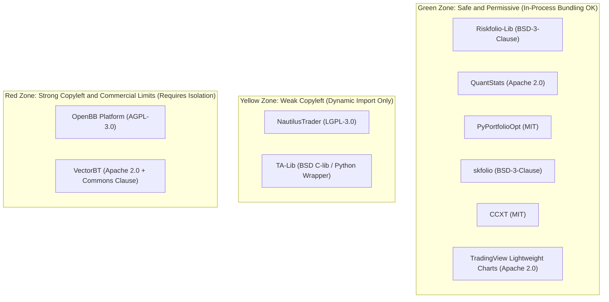

# 03. Licensing Risk & Legal Isolation Matrix

## 1. The 3 Risk Categories in Quant & FinTech Platforms
1. **Software License Contamination** (Permissive vs. Copyleft/AGPL)
2. **Commercial / Fair-Code Restrictions** (Commons Clause, BSL)
3. **Market Data Redistribution Terms of Service (ToS)**

---

## 2. The Traffic Light System



### Green Zone (MIT, BSD-3, Apache 2.0)
- **Safe to use directly inside FinEngine core or first-party plugins.**
- Can be commercialized, closed-source, or bundled without restriction.
- Sole requirement: retain the author's copyright notice in attribution.

### Yellow Zone (LGPL-3.0)
- Safe to import dynamically as a library.
- If you modify the upstream library's source code, those modifications must be shared under LGPL.

### Red Zone (AGPL-3.0 & Commons Clause)
- **OpenBB (AGPL-3.0)**: Contains a "Network Trigger". If directly imported into a FastAPI backend served over a network, it can legally require your entire backend to be open-sourced under AGPL.
- **VectorBT (Commons Clause)**: Prohibits selling products or SaaS services whose primary value is VectorBT itself.

---

## 3. How the Plugin Architecture Acts as a "Legal Firewall"

```
[ FinEngine Core (100% Permissive / Proprietary) ]
       │
       ├── In-Process Import ──> [ Riskfolio-Lib / QuantStats (BSD/Apache) ]
       │
       └── Out-of-Process HTTP/RPC ──> [ Isolated Sidecar Docker: OpenBB (AGPL-3.0) ]
```

1. **Subprocess / Sidecar Isolation**: Running AGPL software in a separate container/process communicating over REST/JSON-RPC keeps the main engine legally unencumbered.
2. **Bring Your Own Key (BYOK)**: For commercial market data providers (Alpha Vantage, Polygon, EODHD), users supply their own API keys in Settings.
3. **Bring Your Own License (BYOL)**: For proprietary tools (VectorBT Pro), the user installs their licensed copy independently.