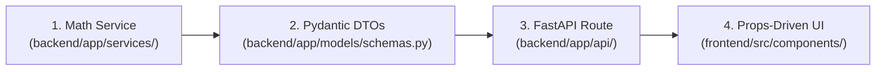

# 05. Core-First Development Guide (How to Approach the Project From Now On)

## 1. Strategic Rule: Finish the Core First
**Do not build the dynamic plugin framework today.** 
Prematurely abstracting into plugins before your core user flow is complete will stall your velocity. 

Instead, build features using the **"Plugin-Ready" pattern** so they can be converted into standalone plugins in less than 30 minutes later.

---

## 2. The 4-Step Standard Development Workflow (For Every New Feature)

Whenever you add any new quantitative model, data pipeline, or analytics studio, follow this exact 4-step sequence:



### Step 1: Write Pure Python Math in `backend/app/services/`
- Keep calculations strictly pure (no FastAPI `Request`, `Response`, or database sessions inside math functions).
- Accept Pandas DataFrames, Numpy arrays, or Python primitives.
- Return pure dictionaries or dataclasses.

```python
# ✅ Pure, testable, plugin-ready
def compute_evt_var(losses: pd.Series, threshold_percentile: float = 0.95) -> dict:
    u = losses.quantile(threshold_percentile)
    excesses = losses[losses > u] - u
    shape, loc, scale = scipy.stats.genpareto.fit(excesses, floc=0)
    ...
    return {"var_99": var_val, "es_99": es_val, "is_fat_tailed": shape > 0.1}
```

### Step 2: Define Strict Schemas in `backend/app/models/schemas.py`
- Explicit typing prevents runtime errors and acts as the future Plugin API contract.

```python
class EVTRiskResponse(BaseModel):
    confidence_level: float
    evt_pot_var_99: float
    evt_pot_es_99: float
    is_fat_tailed: bool
```

### Step 3: Mount the Endpoint in `backend/app/api/`
- The router handles validation, database fetching, and cache lookups, then calls the pure service.

```python
@router.get("/tails", response_model=EVTRiskResponse)
async def get_tail_risk(tickers: str, lookback_days: int = 756):
    returns_df = await fetch_returns_matrix(tickers, lookback_days)
    return compute_evt_var(returns_df["PORTFOLIO"])
```

### Step 4: Build Props-Driven UI Components in `frontend/src/components/`
- Build charts and tables as standalone components that accept data via props.
- Keep them decoupled from global route queries so they can easily be slotted into future plugin dashboards.

```tsx
// Reusable anywhere (Props-driven)
export function TailRiskCard({ var99, es99, isFatTailed }: TailRiskProps) {
  return (
    <Card className="p-4 bg-card border-border">
      <MetricValue label="EVT 99% VaR" value={var99} format="percentage" />
      <MetricValue label="Expected Shortfall" value={es99} format="percentage" />
    </Card>
  );
}
```

---

## 3. The 3 "Plugin-Ready" Golden Rules

```
┌─────────────────────────────────────────────────────────────┐
│                    3 PLUGIN-READY RULES                     │
│                                                             │
│  1. Pure Python Math in services/ (No Request/DB session)   │
│  2. Strict Pydantic Schemas for every input/output          │
│  3. Decoupled UI Components (Props-driven, no page locks)   │
└─────────────────────────────────────────────────────────────┘
```

---

## 4. Quantitative & Platform Invariants to Preserve (From AGENTS.md)

1. **Zero-State Portfolio Weight**: Adding the first asset to an empty portfolio (`positions.length === 0` or `total_value === 0`) must strictly assign **100.00%** (`1.0`). Never use hardcoded arbitrary portfolio totals (e.g. 100000) as fallbacks.
2. **Diversification & Concentration Bounds**: Diversification scores must be computed from true concentration indices ($HHI = \sum w_i^2$, $N_{\text{eff}} = 1/HHI$). A single-holding portfolio ($N \le 1$) must strictly render **0%** diversification score. Never invert generic risk scores.
3. **Inverse-Volatility Risk Parity**: Volatility-adjusted allocations must compute true inverse-volatility weights ($w_i \propto 1/\sigma_i$).
4. **Deterministic Return Compounding**: Monthly returns must be grouped and compounded geometrically via `(1 + r).groupby([year, month]).prod() - 1`.
5. **TanStack Table Accessors**: Table cell renderers must always read row data through `const data = row.original || row;` to prevent `NaN` or unrendered values.
6. **NSE/BSE Formats & Currency**: Ticker validation regexes must support alphanumeric scrip codes, numbers, hyphens, and exchange suffixes (e.g., `3MINDIA.NS`, `MOTHERSON.NS`, `BAJAJ-AUTO.NS`, `500112.BO`). Format Indian equities in Indian Rupee notation (`₹`, `Cr`, `L`) using `en-IN`.
7. **Zero-Mock Policy**: Delete fabricated MetricCard deltas and fake random values (`Math.random`). Metrics must strictly reflect live backend API responses.

---

## 5. Milestone Execution Checklist (Core Completion)

Follow this order of execution to finish the core platform:

- [ ] **Milestone 1: Volatility & Tail Risk**
  - Verify `volatility_service.py` & `tail_risk_service.py`.
  - Expose `GET /api/v1/analytics/vol-cone` and `GET /api/v1/analytics/tails`.
  - Wire `VolConeChart.tsx` and `TailCopulaHeatmap.tsx` to live endpoints.

- [ ] **Milestone 2: Correlation Stability & Cointegration**
  - Verify `correlation_service.py` & `cointegration_service.py`.
  - Expose `GET /api/v1/analytics/correlation-stability` and `GET /api/v1/analytics/coint`.
  - Complete the Pairs Scanner UI (`/pairs`) with `SpreadChart.tsx`.

- [ ] **Milestone 3: India Market Microstructure**
  - Ingest daily NSE Bhavcopy and compute >2σ delivery accumulation flags.
  - Expose `GET /api/v1/analytics/liquidity` (ADV, Days-to-liquidate @ 10%/20%, Amihud illiquidity).
  - Wire the `/india-flows` dashboard.

- [ ] **Milestone 4: Verification & Institutional Export**
  - Client-side institutional PDF tear-sheet via `jsPDF` (`export.ts`).
  - Purge remaining mock data and verify `bun x tsc --noEmit` and `pytest --cov=app --cov-fail-under=80`.

---

## 6. The Transition Trigger: When to Switch to Plugins

Only begin extracting features into the `plugins/` folder when:
1. **The core workflow runs end-to-end**: A user can add holdings $
ightarrow$ view risk metrics $
ightarrow$ run an optimization $
ightarrow$ export a PDF.
2. **Backend test coverage is above 80%**: `pytest` passes with high confidence.
3. **Frontend TypeScript has 0 errors**: `bun x tsc --noEmit` passes cleanly.

At that point, follow [`01-plugin-architecture-blueprint.md`](01-plugin-architecture-blueprint.md) to extract your first plugin (`plugins/quant-cointegration/`) in under 30 minutes!